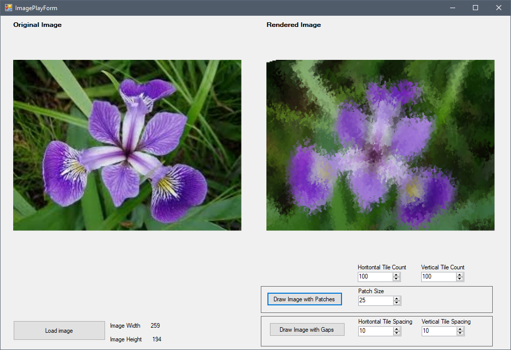
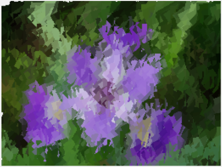

# ImageFun
A small C# project to do fun tricks with photos and images. 

The **MapImage**() function on the **ImagePlayProcessor** class will scan over an image at the specified vertical and horizontal spacing and make a data map of the average pixel color at the location of each sampling point. Then the **DrawPatchedImage**() method will draw "patches" of color at the mapped points to create a new brush stroked sort of image that has a painted impressionist look of the original image.

**Original Image**

**Rendered Image**

**More abstract**
(Fewer tiles, larger patches)

